## ⏳ Submission Countdown (NZT)

<!-- DUE:START -->
```text
⏳ Time remaining: 45 days, 23 hours, 55 minutes
Deadline (NZT): 2025-10-18 00:00 NZDT
Deadline (UTC): 2025-10-17 11:00 UTC
```
<!-- DUE:END -->

---

# VERLAИ: Automatic Recognition & Standardisation of French Verlan

This repository contains the data, code, and experiments for the project
**Automatic Recognition & Standardisation of French Verlan**, led by Eden Li (University of Otago)
under the supervision of Lech Szymanski and Veronica Liesaputra.

---
<details>
<summary>Click to expand</summary>

## 🚀 Quick Start

- Create env: `conda env create -f configs/environment.yml && conda activate verlan`
- Train detector (frozen encoder + LR, Experiment A): `python -m src.detect.detect_train_lr`
- Train detector (BERT+LR variant): `python -m src.detect.detect_train_lr_bert`
- Train detector (end-to-end fine-tune, Experiment B): `python -m src.detect.detect_train_lr_e2e --epochs 3 --batch_size 8 --max_length 128 --lr 2e-5`
- Detect (batch): `python -m src.detect.detect_infer --infile data/raw/mixed_shuffled.txt --outfile data/predictions/mixed_pred.csv --config configs/detect.yaml`
- Convert (single): `python -m src.convert.convert_infer --text "il a fumé un bédo avec ses rebeus" --config configs/convert.yaml`
- Detect (BERT fine-tuned): `python -m src.detect.frtect_infer_bert --text "il a fumé un bédo avec ses rebeus"`
  - Batch: `python -m src.detect.frtect_infer_bert --infile data/raw/mixed_shuffled.txt --outfile data/predictions/mixed_pred.csv`
  - Uses model at `models/detect/latest/camembert` by default; override with `--model_dir`.

### Ablation (L8)
- Run Taguchi L8 ablation of pooling/L2/calibration/threshold:
  `python scripts/run_l8_ablation.py --data_path data/processed/verlan_test_set.csv --max_len 256 --batch_size 32 --load_in_4bit --bnb_quant_type nf4 --compute_dtype bfloat16 --device_map auto`
- By default, it will try to load a pretrained LR head from `models/detect/latest/lr_head.joblib`. Override with `--lr_head_path` or omit the file to fit from scratch on the train split.

### Plot Probability Histogram
- Draw overlapping histograms for Verlan vs Standard probabilities from a predictions CSV.
- Example (produces `docs/results/lr_with_bert_ds_balanced/prob_dist.png`):
  `python src/plot/plot_probability_histogram.py --csv data/predictions/2025-08-29/mixed_shuffled_pred.csv --out docs/results/lr_with_bert_ds_balanced/prob_dist.png`
- Options:
  - `--prob-col` and `--label-col` to override auto-detection
  - `--bins` to set number of bins (default 20)

Notes
- Packaging: `src` is a Python package. Prefer running scripts via `python -m src.<module>`.
- Backward compatibility wrappers exist at `src/detect_infer.py` and `src/convert_infer.py`.

---

## 🎯 Project Goals

1. Automatic detection of verlan tokens in contemporary French text.
2. Standardisation of detected verlan forms into canonical French equivalents.
3. Build a reproducible open pipeline with dataset, models, and evaluation reports.

---

## 📂 Repository Structure

<!-- TREE:START -->
```text
project-root/
├── configs/
│   ├── convert.yaml
│   ├── detect.yaml
│   └── environment.yml
├── data/
│   ├── predictions/
│   │   ├── invented.csv
│   │   ├── mixed_pred.csv
│   │   ├── standard_only_pred.csv
│   │   └── verlan_only_pred.csv
│   ├── processed/
│   │   ├── verlan_pairs.csv
│   │   └── verlan_test_set.csv
│   └── raw/
│       ├── GazetteerEntries.xlsx
│       ├── Sentences.xlsx
│       ├── Sentences_balanced.xlsx
│       ├── invented_verlan_mixed_paired.txt
│       ├── mixed_shuffled.txt
│       ├── mixed_shuffled_pred.csv
│       ├── standard_only.txt
│       └── verlan_only.txt
├── docs/
│   └── results/
│       ├── lr_with_bert/
│       │   ├── embedding_space_tsne.png
│       │   └── embedding_space_umap.png
│       └── only_lr_no_bert_ds_imbalance/
│           ├── embedding_space_pca.png
│           ├── embedding_space_tsne.png
│           ├── embedding_space_umap.png
│           ├── prob_dist_post.png
│           └── prob_dist_pre.png
├── models/
│   ├── convert/
│   │   ├── 2025-08-20/
│   │   │   └── mistral-verlan-conv/
│   │   └── latest/
│   │       └── mistral-verlan-conv/
│   └── detect/
│       ├── 2025-08-24 LR/
│       │   └── lr_head.joblib
│       ├── 2025-08-29/
│       │   └── lr_head.joblib
│       └── latest/
│           └── lr_head.joblib
├── scripts/
│   ├── ci_update_docs.py
│   ├── generate-tree.py
│   └── run_l8_ablation.py
├── src/
│   ├── convert/
│   │   ├── convert_infer.py
│   │   └── convert_train.py
│   ├── detect/
│   │   ├── detect_infer.py
│   │   ├── detect_train_lr.py
│   │   └── detect_train_lr_bert.py
│   ├── evaluate/
│   │   └── calibration.py
│   ├── plot/
│   │   ├── plot_probability_histogram.py
│   │   └── visualize_embeddings.py
│   ├── experiments/
│   │   └── run_l8_ablation.py
│   ├── utils.py
│   ├── detect_infer.py        # wrapper → detect/detect_infer.py
│   └── convert_infer.py       # wrapper → convert/convert_infer.py
└── tests/
    ├── run_l8_ablation.py     # wrapper → src/experiments/run_l8_ablation.py
    ├── test_convert_infer.py
    ├── test_detect_infer.py
    └── test_tokenization.py
```
<!-- TREE:END -->

To update manually:

```bash
python scripts/generate-tree.py > repo_tree.txt
```
 </details>
---

## 🧵 Aoraki Cluster (GPU)

- Account: request access via the RTIS Aoraki signup page and note your SLURM account name.
- GPUs: Prefer `aoraki_gpu_H100` or `aoraki_gpu_A100_80GB` to finish E2E in ~3 hours.

Setup on login node:
- Install Miniforge if needed: `wget https://github.com/conda-forge/miniforge/releases/latest/download/Miniforge3-Linux-x86_64.sh && bash Miniforge3-Linux-x86_64.sh -b -u`
- Create env in-project: `bash scripts/aoraki/create_env.sh`

Submit training (auto-picks best available GPU partition):
- `export AORAKI_ACCOUNT=<your_slurm_account>`
- Optional: force a partition, e.g. `export AORAKI_PARTITION=aoraki_gpu_H100`
- `bash scripts/aoraki/submit_e2e.sh`

Direct sbatch (no wrapper):
- `sbatch --account=$AORAKI_ACCOUNT scripts/aoraki/train_e2e.slurm`
- Tune via env: `EPOCHS=3 BATCH_SIZE=8 MAX_LEN=128 LR=2e-5 sbatch --account=$AORAKI_ACCOUNT scripts/aoraki/train_e2e.slurm`

Notes
- Logs: `logs/verlan-e2e-<jobid>.out|.err` on the cluster.
- Caches: model weights cached under `.cache/huggingface` in the repo.
- If the H100/A100_80GB queues are busy, wrapper falls back to `aoraki_gpu_A100_40GB`, then `aoraki_gpu_L40`, then `aoraki_gpu`.
- If you see a Miniforge error, re-run `bash scripts/aoraki/create_env.sh` on the login node.

---

## 📚 Lexicon

- AP – Average Precision; area under the precision–recall curve.
- CLS - classifications
- CRF – Conditional Random Field; probabilistic model for sequence labelling.
- F1 – F1 score; harmonic mean of precision and recall.
- KS – Kolmogorov–Smirnov statistic; measures distance between distributions.
- LR – Logistic Regression; linear classifier for binary tasks.
- PCA – Principal Component Analysis; linear dimensionality reduction method.
- ROC-AUC – Receiver Operating Characteristic – Area Under the Curve; classification performance metric.
- t-SNE – t-distributed Stochastic Neighbor Embedding; non-linear dimensionality reduction for visualisation.
- UMAP – Uniform Manifold Approximation and Projection; manifold-learning approach for dimensionality reduction.
- VDL – Verlan Dataset Lexicon; project corpus and seed lexicon.

---

## 🔍 Detection Pipelines

### Mistral-7B
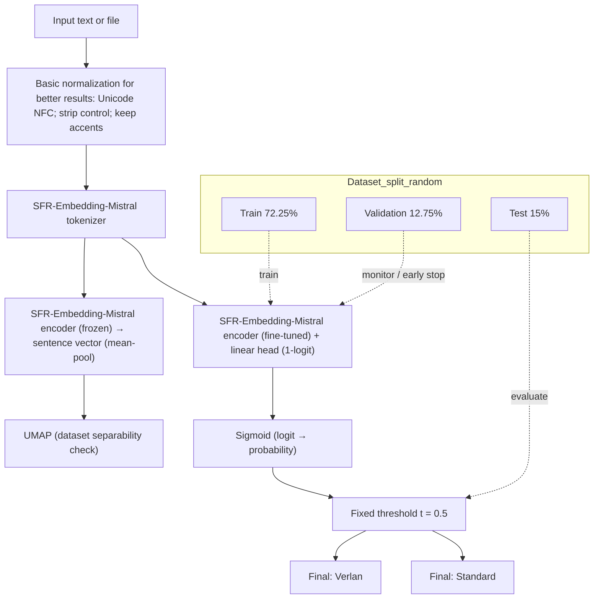

### Experiment B (E2E Fine-tuning) – Usage

- Baseline (Experiment A – Frozen encoder + LR):
  - `python -m src.detect.detect_train_lr --batch_size 32 --max_length 512`
- Experiment B (Unfrozen encoder, end-to-end fine-tune with mean pooling + linear head):
  - Minimal GPU run: `python -m src.detect.detect_train_lr_e2e --epochs 3 --batch_size 8 --max_length 128 --lr 2e-5`
  - With 4-bit loading (lower VRAM; training effectiveness may be limited without PEFT/LoRA):
    `python -m src.detect.detect_train_lr_e2e --epochs 3 --batch_size 8 --max_length 128 --lr 2e-5 --load_in_4bit`

Outputs
- Saves the best checkpoint under `models/detect/latest/lr_e2e/model.pt` with `meta.json` (includes the chosen threshold on validation).
- Prints validation AUC/AP and the scanned best F1 threshold; reports test AUC/AP/F1@t* for comparison to Experiment A.

Interpretation Guide
- If Experiment B ≈ Experiment A → suggests Mistral already encodes verlan patterns linearly.
- If Experiment B » Experiment A → suggests fine-tuning is necessary to capture verlan knowledge.

### Mistral-7B + BERT

```mermaid
flowchart TB
  %% ===== Stratified split (fixed on 2 Sept) =====
  subgraph Dataset_split_stratified
    direction TB
    S1["Train 72.25%"]
    S2["Validation 12.75%"]
    S3["Test 15%"]
  end

  %% ===== Ingestion & normalization =====
  A["Input text or file"] --> N["Basic normalization for better results: Unicode NFC; strip control; keep accents"]

  %% ===== Tokenize once for both branches =====
  N --> T["Mistral 7B tokenizer"]

  %% ===== Branch 1: Diagnostic UMAP (frozen encoder; not used for training) =====
  T --> ENC_FZ["CamemBERT encoder (frozen) → sentence vector (mean-pool or [CLS])"]
  ENC_FZ --> MAP["UMAP (dataset separability check)"]

  %% ===== Branch 2: Classifier (fine-tune) =====
  T --> ENC["CamemBERT encoder (fine-tuned) + linear head (1-logit)"]
  ENC --> P["Sigmoid (logit → probability)"]
  P --> TH["Fixed threshold t = 0.5 (for now)"]
  TH --> V1["Final: Verlan"]
  TH --> V0["Final: Standard"]

  %% ===== Split linkage =====
  S1 -. "train" .-> ENC
  S2 -. "monitor / early stop" .-> ENC
  S3 -. "evaluate" .-> TH

  ```

### Neural Network (ignore this for now)

```mermaid
flowchart TB
    A[Input text or file] --> B1[Tokenizer]
    A --> B2[UTF-8 byte IDs]
    B1 --> C1[LLM Encoder]
    B2 --> C2[CharCNN]
    C1 --> D[Concatenate]
    C2 --> D
    D --> E[ArcFace Classifier]
    E --> F[Temperature Scaling]
    F --> G{Gazetteer Gate}
    G -- allow --> H[Final prediction: Verlan]
    G -- block --> I[Final prediction: Standard]
```

<!-- #### Why does the LLM + LR pipeline perform so well?

- The encoder does the heavy lifting. The Mistral embedding is trained on billions of sentences and already separates verlan and non-verlan contexts in vector space.
- The task is nearly linear. Verlan tokens occupy distinct regions in the embedding space, allowing a simple linear boundary to distinguish them.
- Dictionary gating adds robustness. The lexicon-based post-processing corrects many potential misclassifications from the classifier.
- LR only cuts the final boundary. With rich embeddings and a binary objective, a linear classifier achieves high accuracy with minimal complexity. 
This is entirely chatgpt generated shit
-->

---
<details>
<summary>Click to expand</summary>
## 🚀 Getting Started

1. Setup environment

```bash
conda env create -f configs/environment.yml
conda activate verlan
```

2. Hugging Face login (for models & datasets)

```bash
huggingface-cli login
```

3. Run detector training

```bash
python -m src.detect.detect_train_lr_bert
```

4. Run detector inference

```bash
python -m src.detect.detect_infer \
  --infile data/raw/mixed_shuffled.txt \
  --outfile data/predictions/mixed_pred.csv \
  --config configs/detect.yaml
```

5. Run conversion inference

```bash
python -m src.convert.convert_infer --text "il a fumé un bédo avec ses rebeus" --config configs/convert.yaml
```

```bash
python -m src.detect.detect_infer --infile data/processed/verlan_test_set.csv
 --outfile data/raw/mixed_shuffled_pred.csv --config configs/detect.yaml --no_gate
```

6. Visualise embedding space

Plot sentence embeddings in 2‑D and overlay the logistic regression boundary.
Choose the dimensionality reducer (`pca`, `tsne`, or `umap`) and how many
examples to sample. UMAP requires the optional dependency `umap-learn`.

```bash
python -m src.plot.visualize_embeddings --reducer umap --num-points 500 \
  --outfile docs/results/embedding_space_umap.png
```

7. Plot probability distribution (histogram)

```bash
python src/plot/plot_probability_histogram.py \
  --csv data/predictions/2025-08-29/mixed_shuffled_pred.csv \
  --out docs/results/lr_with_bert_ds_balanced/prob_dist.png
```
Options: `--prob-col` and `--label-col` override auto-detection; `--bins` controls bin count.

### Script pairs

- `convert/convert_train.py` ↔ `convert/convert_infer.py`
- `detect/detect_train_lr_bert.py` ↔ `detect/detect_infer.py`

### Model directory alias

Models are stored under `models/<task>/<YYYY-MM-DD>/` with a `latest` symlink.
Update the symlink to switch versions.

---

## 📊 Current Status
- ✅ Data collection + annotation (Gold Corpus v1 ready).
- ✅ Baseline (rules + dictionary).
- ✅ Calibration & threshold optimization for verlan detector.
- 🔄 CamemBERT+CRF fine-tuning (in progress).
- 🔄 GPT-4o few-shot & Mistral-7B tokenizer (testing).
- ⏳ Final evaluation + fairness audit (Sept–Oct 2025).
- ⏳ Draft writing (Sept–Oct 2025).
</details>
---

## 📝 Project Log

<!-- <details>
<summary>Click to expand</summary> -->


### September 15, 2025 – Added Experiment B (Unfrozen encoder)

I added `src/detect/detect_train_lr_e2e.py`, which fine-tunes the Mistral encoder end-to-end with the same mean-pooling + L2 + linear head used by the LR baseline. This enables a clean comparison with the current frozen-encoder pipeline. The plan is to:

- Train baseline (Experiment A): frozen encoder + CPU LR on sentence embeddings.
- Train Experiment B: unfrozen encoder + linear head, end-to-end.
- Compare on the same fixed splits. If E2E ≈ frozen, Mistral likely already encodes verlan; if E2E is clearly better, verlan was learned during fine-tuning.


### September 8, 2025 – Calibration and Pooling in Mistral+LR

After Lech’s reminder that my Logistic Regression (LR) implementation might contain an error, I re-checked the code carefully and found no sign of label leakage. To verify, I stripped away all the “buffs” (mean pooling, L2 normalisation, calibration, threshold tuning, Gazetteer Gate) and ran plain LR. As expected, the model collapsed into near-random guessing, illustrated in 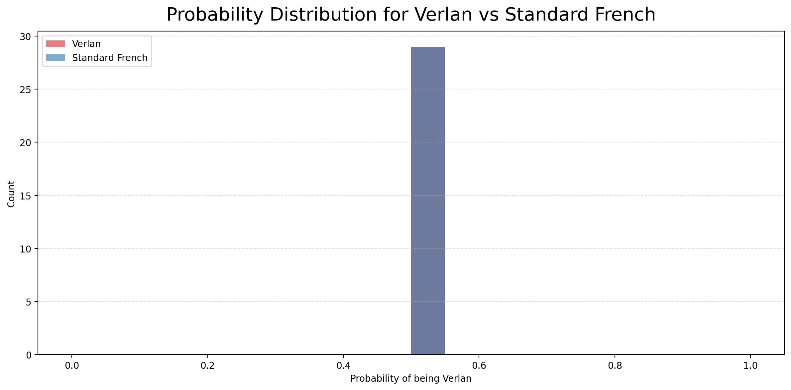.

This led me to suspect that calibration or pooling might be playing a crucial role. The embedding code is:

```python
H = out.last_hidden_state           # [B, T, D]
mask = enc["attention_mask"].unsqueeze(-1).to(H.dtype)  # [B, T, 1]
denom = mask.sum(dim=1).clamp(min=1) # [B, 1]
pooled = (H * mask).sum(dim=1) / denom  # Mean pooling over valid tokens
pooled = torch.nn.functional.normalize(pooled, p=2, dim=1)  # L2 norm
```

Here:

* `H` is the hidden state of all tokens.
* `mask` ensures padding tokens are ignored.
* `pooled` averages only the valid tokens → **Mean Pooling**.
* Normalisation projects the vector to unit length → **L2 Norm**.

To isolate which factor matters most, I ran a compressed set of 8 controlled trials (Taguchi L8 design). Example results on the **balanced dataset** (randomised split) are:

```
Run 6 (MEAN, no-L2, Calib on, thr=0.5): AUC=1.0, F1=0.67
Run 7 (MEAN, L2 on, no-Calib, thr=0.5): AUC=1.0, F1=0.86
Run 8 (MEAN, L2 on, Calib on, thr=t*): AUC=1.0, F1=0.89
CLS-only runs: AUC stuck at 0.25–0.5, F1 near 0
```

**Finding:** *Mean Pooling is the decisive factor*. Without it (CLS-only), the model fails completely. With Mean Pooling, adding either L2 or calibration further stabilises the separation.

However, the AUC and F1 being 1.0 on this dataset raised concerns of overfitting. To check, I created a second test set containing only **invented verlan forms** (never seen in any lexicon but following verlan rules). Results dropped to **AUC ≈ 0.68, F1 ≈ 0.66**, showing the model can no longer achieve perfect separation. Since both datasets share the same structure and labels, this strongly suggests there is **no dataset leakage**—the difference comes from distribution difficulty.

In short:

* **Plain LR does not work** (random baseline).
* **Mean Pooling + (L2 or calibration)** enables separation, even on unseen verlan.
* Performance drops on invented OOD verlan, confirming no leakage but still showing promising generalisation.
* Compared with the neural Mistral→CamemBERT pipeline (without calibration), LR+calibration is surprisingly strong (see the 2×2 plots below). I will next attempt to integrate calibration into the neural pipeline.

Plots for comparison:

* 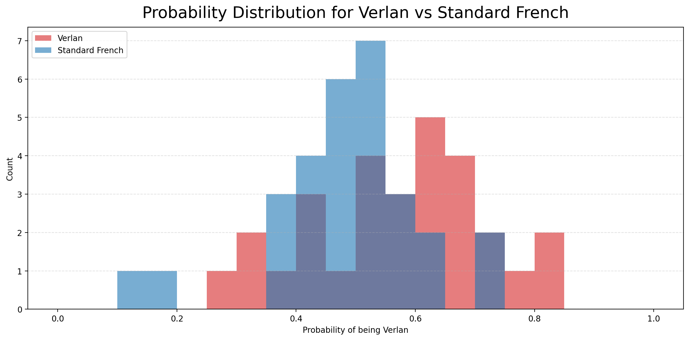
(the one above) Probability distribution for Mistral+CamemBERT (no calibration) on random test set

* 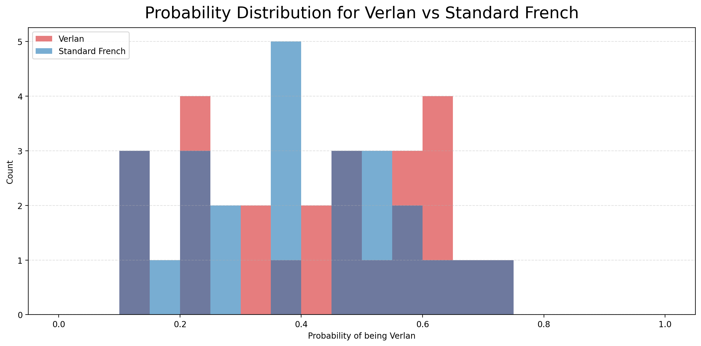
(the one above) Probability distribution for Mistral+CamemBERT (no calibration) on invented verlan test set

* 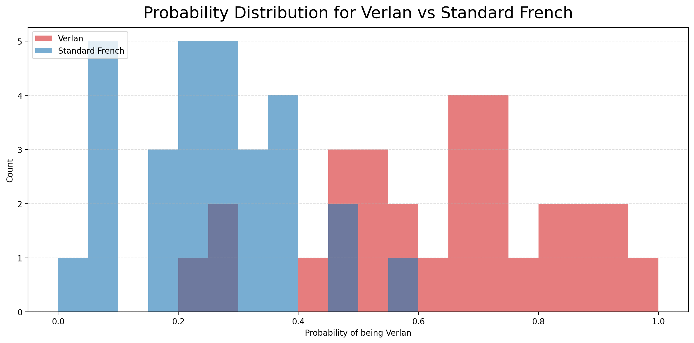
(the one above) Probability distribution for LR (with mean pooling + L2 + calibration) on random test set

* 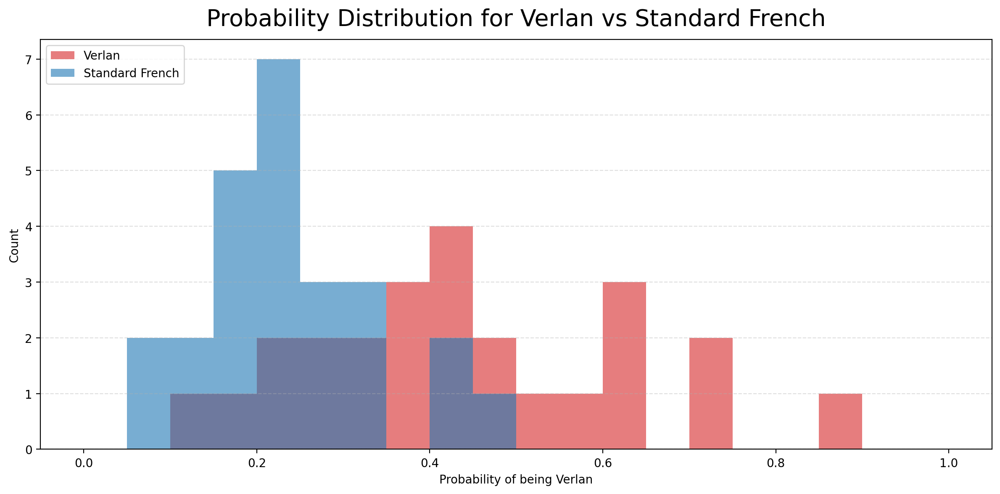
(the one above) Probability distribution for LR (with mean pooling + L2 + calibration) on invented verlan test set

**Conclusion:** Logistic Regression alone is ineffective, but with mean pooling and calibration it becomes a surprisingly competitive baseline—even outperforming the current neural pipeline without calibration.

---

### September 2, 2025 – LR vs BERT+LR, dataset balance, and plots

I implemented a **BERT+LR variant** (`src/detect/detect_train_lr_bert.py`). The idea was to train a CPU `LogisticRegression` head on top of sentence embeddings from **Salesforce/SFR-Embedding-Mistral** (4-bit, BF16).

**Pipeline details:**

* Tokenize and encode sentences.
* Mean-pool token vectors using the attention mask → **unit sentence embedding** via L2 normalization.
* Add one extra binary heuristic from CamemBERT: *if a token splits into multiple pieces but its reverse forms a single token, flag = 1*.
* Concatenate `[embedding, heuristic]` and fit LR with `class_weight="balanced"`, `max_iter=2000`.
* Save trained heads under `models/detect/YYYY-MM-DD/` and symlink to `models/detect/latest/`.

**Supporting tools:**

* Inference (`src/detect/detect_infer.py`) now supports batching, custom thresholds, and optional gazetteer/fuzzy gates.
* Visualization (`src/plot/visualize_embeddings.py`) aligns embeddings with the trained LR head (including the heuristic dimension if present) before PCA/UMAP.
* Added `src/plot/plot_probability_histogram.py` for probability distributions. Charts compare **balanced vs imbalanced** datasets.

**Findings:**

* **BERT+LR underperforms LR-only**: the 1-D heuristic tends to add noise. Likely reasons:

  * Concatenating a binary feature to a unit-norm vector skews feature scaling; LR weights can adjust, but the mismatch may give the single bit disproportionate influence.
  * I’m using SFR-Embedding-Mistral with manual pooling, not CamemBERT’s own embedding head. If the model expects a different pooling or `trust_remote_code=True`, my version may be suboptimal.
* **Balanced vs imbalanced**: balancing improves recall for “is verlan” (more high-probability mass) but increases false positives (non-verlan distribution shifts right).

---

### August 26, 2025 – Reflection after supervisor meeting

After discussion with Lech and Veronica, I realized the main issue was **not overfitting**, but **post-processing leakage via the Gazetteer Gate**.

**Pipeline flowchart:**

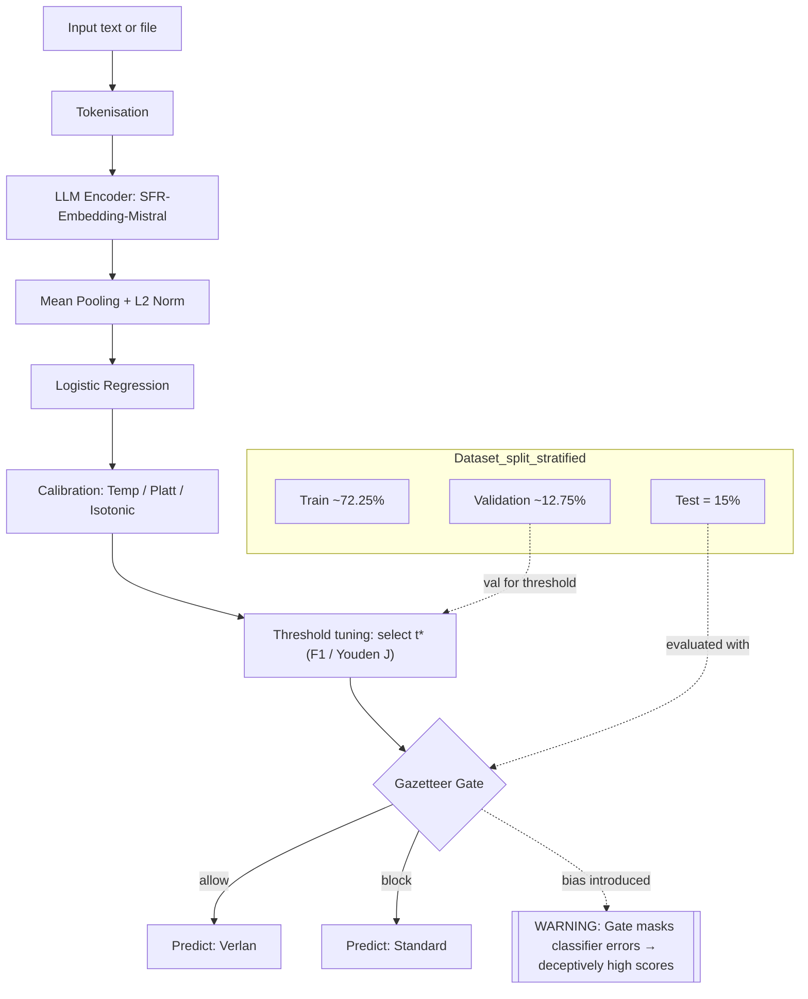

**Observations:**

* Calibration + threshold tuning improved separation:

  * Scanning validation thresholds gave F1/Youden J optima.
  * Temperature scaling spread probabilities.
  * Platt/isotonic calibration trimmed the “gray zone” near 0.5.
* But the **Gate** introduced bias: if most test verlan are lexicon-covered, the gate can mask classifier errors and inflate scores.

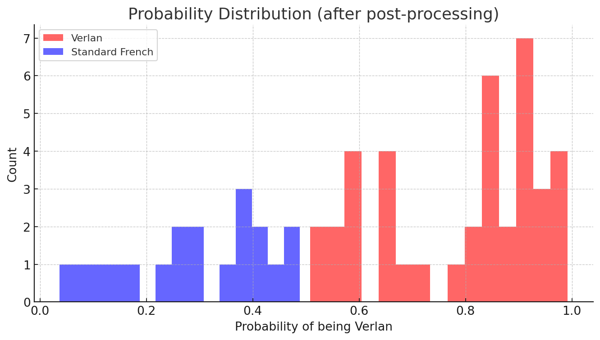

**Takeaways:**

* The test set must separate **existing vs invented verlan** to evaluate generalization properly.
* Visualizations (PCA, t-SNE, UMAP) show structure: UMAP provides clearer clusters, while t-SNE is more mixed.
* Logistic Regression boundaries are too simple for complex embeddings → motivates stronger models.
* Dataset rebalancing remains essential for fair evaluation.

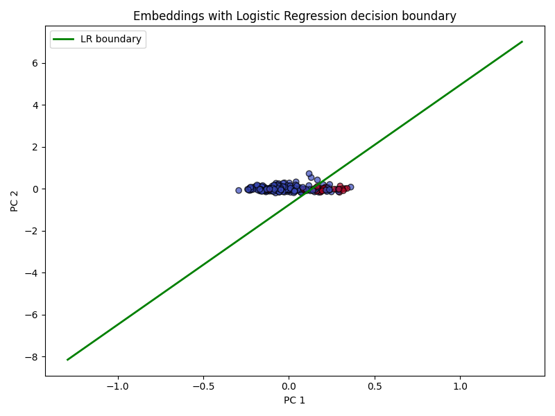 | 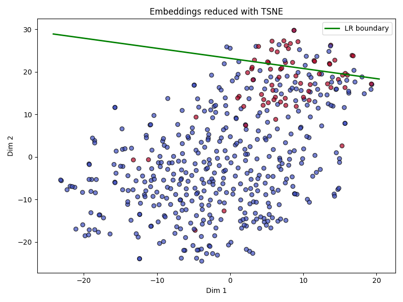 | 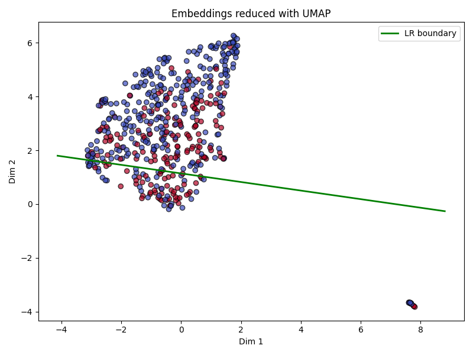

---

### August 26, 2025 – Supervisor meeting

* Reinforced the need for **balanced datasets** and **cross-validation** to avoid spurious results.
* Current pipeline (Mistral embeddings + LR) has limits and calibration risks.
* Plan to benchmark advanced models (CamemBERT, mT5, fine-tuned Mistral).
* Action items:

  * Visualize sentence embeddings (t-SNE/UMAP).
  * Balance data and re-run baselines.
  * Systematically compare multiple models.
  * Document the full pipeline clearly for review.

---

### August 23–25, 2025 – Baseline evaluation and neural network experiments

Between Aug 23–25, I evaluated baselines and began neural training.

**Baseline (LR):**

* Threshold tuning + calibration improved metrics on training/val but exposed overfitting.
* Validation remained weak → **generalization problem**.

**Code/infra improvements:**

* Added progress bars, GPU checks, import safeguards.
* Fixed CharCNN pooling kernel bug.
* Froze encoder to reduce GPU memory load.

**Initial neural net run (`detect_train_nn.py`):**

* After 1 epoch: **AP = 0.39, AUC = 0.81, KS = 0.50, t* = 0.87, F1 = 0.25*\*.
* Promising AUC, but F1 still low → needs more epochs and systematic validation.

**Why try NNs?**

* LR is strong but limited. NNs can:

  * Learn richer contextual features beyond handcrafted inputs.
  * Potentially generalize better, especially against calibration overfitting.
  * Offer extensibility for multilingual transfer or end-to-end pipelines.
* Even if not superior immediately, NNs set an upper bound and keep the project future-proof.

---

### August 23, 2025 – Repository reorganisation

* Restructured data directories and tidied repository layout.

---

### August 12, 2025 – Baseline data and scripts

* Imported raw datasets and annotation resources.
* Added initial `detect.py` + `convert.py` scripts.
* Set up environment and evaluation utils.
* Created test corpora and baseline predictions.

---

### July 11, 2025 – Initial repository setup

* Created project skeleton.
* Added license.

<!-- </details> -->

---

<details>
<summary>Click to expand</summary>

## 📈 Valid Research Results

- Aug 2025: Baseline detector (commit 4dacd82) produced overlapping probability distributions between verlan and standard French:

  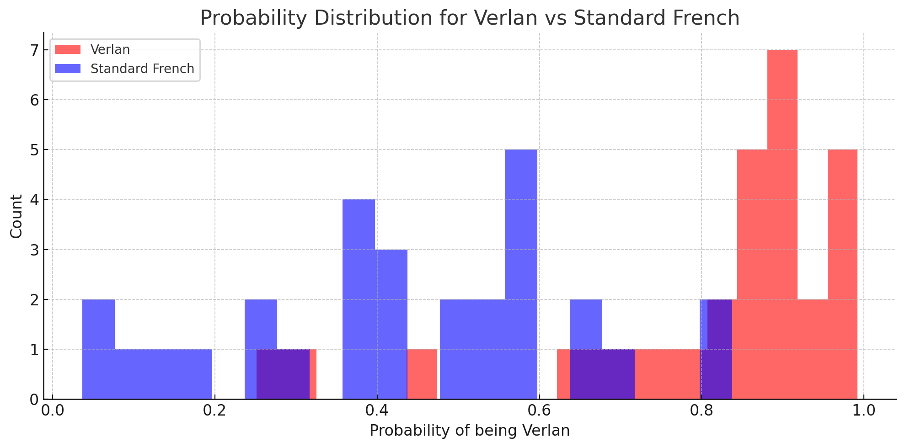

- Sept 2025: BERT+LR on imbalanced dataset — probability distribution of predicted “verlan” scores for verlan vs standard sentences. Red shifts right but overlaps remain substantial.

  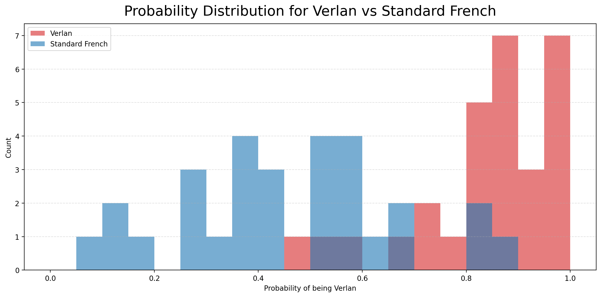

- Sept 2025: BERT+LR on balanced dataset — verlan (red) concentrates more at high scores (better sensitivity), but standard (blue) also moves right (lower specificity). Overall separation is only modestly improved.

  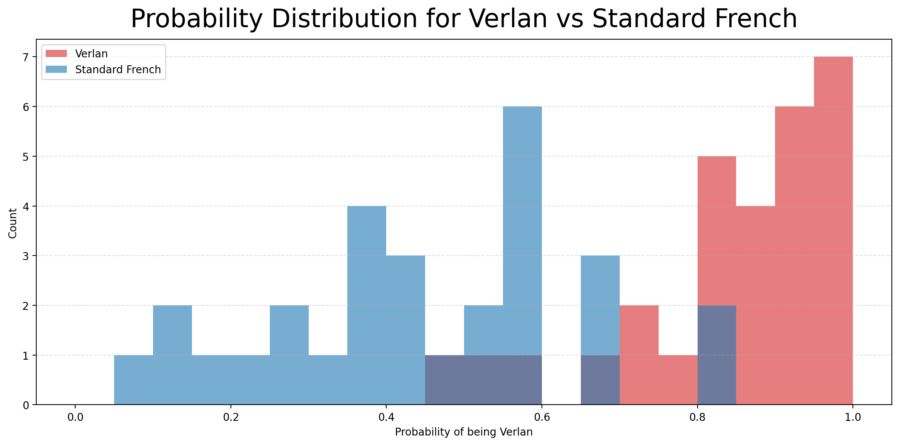

</details>
