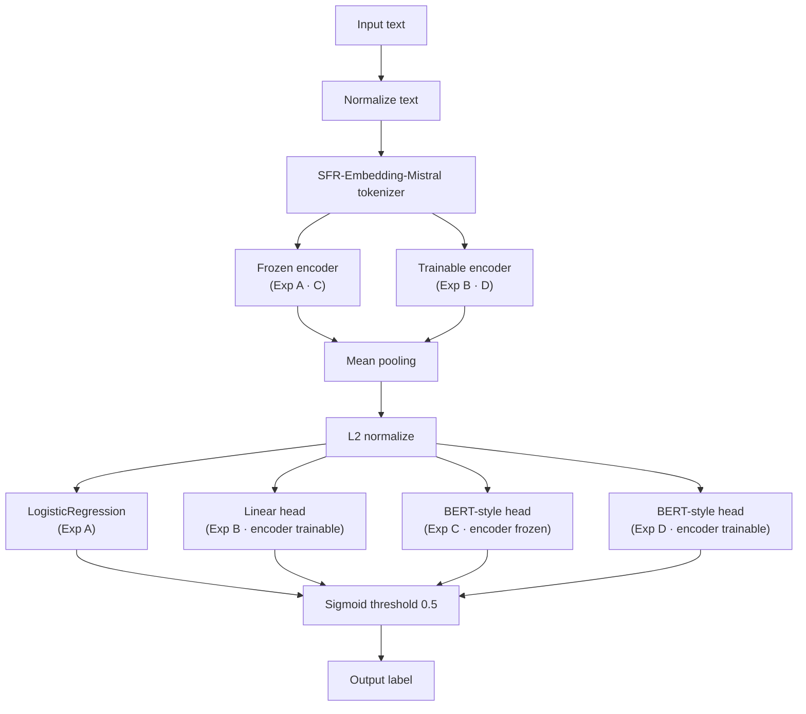

# Detect Pipeline Variants

All four experiments share the same preprocessing before branching into encoder/head configurations. The diagram below merges the paths while labelling which experiments use each branch.

