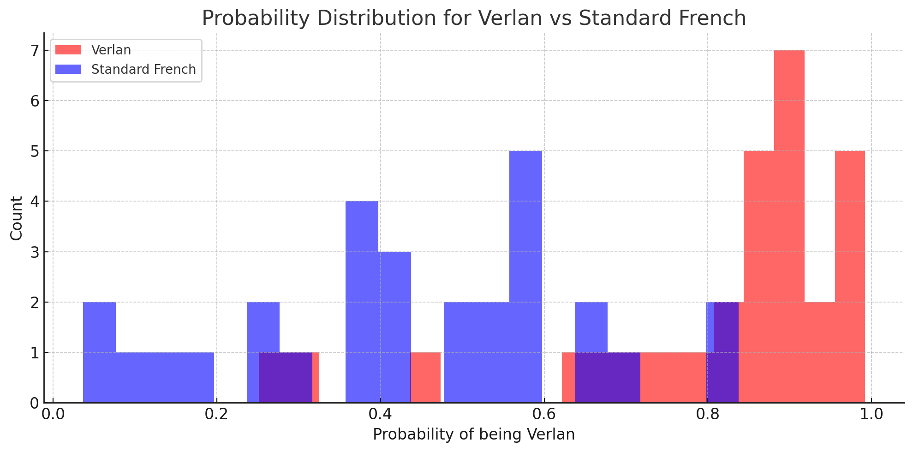
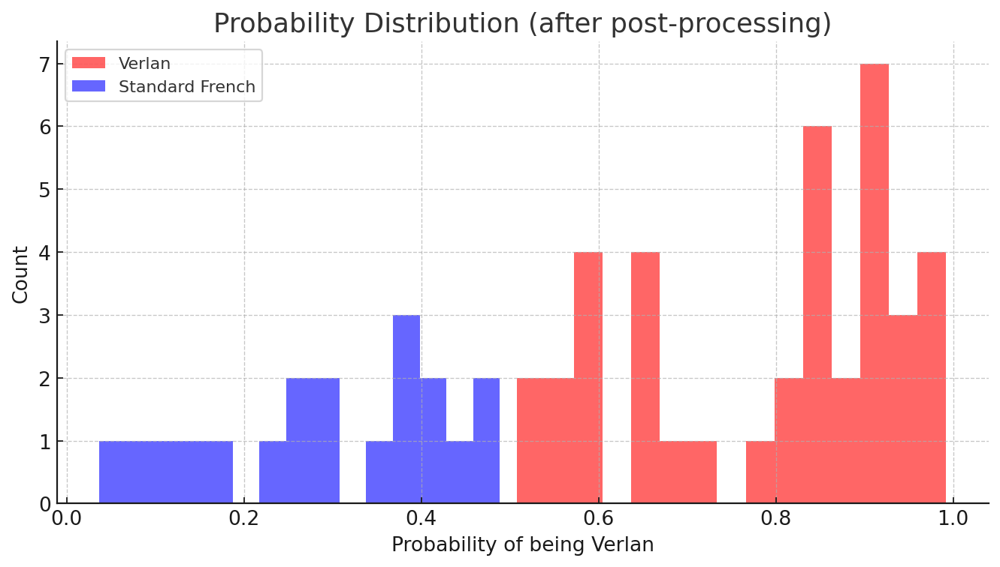

# VERLAИ: Automatic Recognition & Standardisation of French Verlan

This repository contains the data, code, and experiments for the project  
**Automatic Recognition & Standardisation of French Verlan**, led by Eden Li (University of Otago)  
under the supervision of Lech Szymanski and Veronica Liesaputra.

---

## ⏳ Submission Countdown (NZT)

<!-- DUE:START -->
```text
⏳ Time remaining: 53 days, 16 hours, 27 minutes
Deadline (NZT): 2025-10-18 00:00 NZDT
Deadline (UTC): 2025-10-17 11:00 UTC
```
<!-- DUE:END -->

---

## 🎯 Project Goals

1. **Automatic detection** of verlan tokens in contemporary French text.  
2. **Standardisation** of detected verlan forms into canonical French equivalents.  
3. Build a **reproducible open pipeline** with dataset, models, and evaluation reports.  
4. Conduct a **sociolinguistic analysis** of verlan usage patterns.

Target venues: **VarDial 2026 (ACL)** or **TALN 2025**.

---

## 📆 Milestones

- **May 2025 (done):** Crawled 1M tokens, VDL v0.1 (raw corpus, seed lexicon).
- **June 2025 (done):** 30k token annotation, rule+lexicon baseline.
- **July 2025 (done):** CamemBERT+CRF fine-tuning baseline.
- **Aug 2025 (done):** Logistic regression detector + calibration utilities; improved probability distribution separation.
- **Sept–Oct 2025:** Final fine-tuning, full evaluation, fairness audit, draft writing, submission.

---

## 📂 Repository Structure

<!-- TREE:START -->
```text
project-root/
├── configs/
│   ├── convert.yaml
│   ├── detect.yaml
│   └── environment.yml
├── data/
│   ├── predictions/
│   │   ├── invented.csv
│   │   ├── mixed_pred.csv
│   │   ├── standard_only_pred.csv
│   │   └── verlan_only_pred.csv
│   ├── processed/
│   │   ├── verlan_pairs.csv
│   │   └── verlan_test_set.csv
│   └── raw/
│       ├── GazetteerEntries.xlsx
│       ├── Sentences.xlsx
│       ├── invented_verlan.txt
│       ├── mixed_shuffled.txt
│       ├── standard_only.txt
│       └── verlan_only.txt
├── docs/
│   ├── readme.md
│   └── results/
│       ├── prob_dist_post.png
│       └── prob_dist_pre.png
├── models/
│   ├── convert/
│   │   ├── 2025-08-20/
│   │   │   └── mistral-verlan-conv/
│   │   └── latest/
│   │       └── mistral-verlan-conv/
│   └── detect/
│       ├── 2025-08-24/
│       │   └── lr_head.joblib
│       └── latest/
│           └── lr_head.joblib
├── scripts/
│   ├── ci_update_docs.py
│   └── generate-tree.py
├── src/
│   ├── EvaluateThreshold.py
│   ├── calibration.py
│   ├── convert_infer.py
│   ├── convert_train.py
│   ├── detect_infer.py
│   └── detect_train.py
└── tests/
    ├── test_convert_infer.py
    ├── test_detect_infer.py
    └── test_tokenization.py
```
<!-- TREE:END -->

To update manually:
```text
python scripts/generate-tree.py > repo_tree.txt
```

---

## 🚀 Getting Started

1. Setup environment

```bash
conda env create -f environment.yml
conda activate verlan
```

2. Hugging Face login (for models & datasets)

```bash
huggingface-cli login
```

3. Run detector training

```bash
python src/detect_train.py
```

4. Run detector inference

```bash
python src/detect_infer.py --infile data/raw/mixed_shuffled.txt --outfile data/predictions/mixed_pred.csv --config configs/detect.yaml
```

5. Run conversion inference

```bash
python src/convert_infer.py --text "il a fumé un bédo avec ses rebeus" --config configs/convert.yaml
```

### Script pairs

- `convert_train.py` ↔ `convert_infer.py`
- `detect_train.py` ↔ `detect_infer.py`

### Model directory alias

Models are stored under `models/<task>/<YYYY-MM-DD>/` with a `latest` symlink.
Update the symlink to switch versions.


---

## 📊 Current Status
- ✅ Data collection + annotation (Gold Corpus v1 ready).
- ✅ Baseline (rules + dictionary).
- ✅ Calibration & threshold optimization for verlan detector.
- 🔄 CamemBERT+CRF fine-tuning (in progress).
- 🔄 GPT-4o few-shot & Mistral-7B tokenizer (testing).
- ⏳ Final evaluation + fairness audit (Sept–Oct 2025).
- ⏳ Draft writing (Sept–Oct 2025).

 
## 📈 Research Results

- **Aug 2025:** Baseline detector (commit 4dacd82) produced overlapping probability distributions between verlan and standard French:

  

- **Aug 2025:** After introducing calibration utilities and threshold optimization (commit fcbfcb0), post-processing separated the classes:

  

---

## 📌 Notes
	•	All results will be released on Zenodo with DOI.
	•	Reproducibility ensured via conda environment + fixed random seeds.


---

## Reference

- Dholakia, P. (2023). *Comparative analysis of transformer-based models for text-to-speech normalization* (Master's thesis, San José State University). https://doi.org/10.31979/etd.5dd6-k38w
- Lertpiya, A. (2019). *Thai spelling correction and word normalization on social text using a two-stage pipeline with neural contextual attention* (Master's thesis, Chulalongkorn University). https://doi.org/10.58837/chula.the.2019.155
- Tan, Y. L. (2024). *Improving transformer for scene text and handwritten text recognition* (Doctoral dissertation, Nanyang Technological University). https://doi.org/10.32657/10356/178284