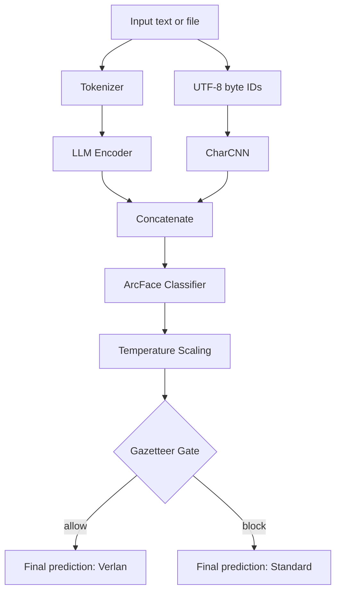

# VERLAИ: Automatic Recognition & Standardisation of French Verlan

This repository contains the data, code, and experiments for the project  
**Automatic Recognition & Standardisation of French Verlan**, led by Eden Li (University of Otago)  
under the supervision of Lech Szymanski and Veronica Liesaputra.

---

## ⏳ Submission Countdown (NZT)

<!-- DUE:START -->
```text
⏳ Time remaining: 46 days, 04 hours, 21 minutes
Deadline (NZT): 2025-10-18 00:00 NZDT
Deadline (UTC): 2025-10-17 11:00 UTC
```
<!-- DUE:END -->

---

## 🎯 Project Goals

1. **Automatic detection** of verlan tokens in contemporary French text.  
2. **Standardisation** of detected verlan forms into canonical French equivalents.  
3. Build a **reproducible open pipeline** with dataset, models, and evaluation reports.  

---

## 📆 Milestones

- **May 2025 (done):** Crawled 1M tokens, VDL v0.1 (raw corpus, seed lexicon).
- **June 2025 (done):** 30k token annotation, rule+lexicon baseline.
- **July 2025 (done):** CamemBERT+CRF fine-tuning baseline.
- **Aug 2025 (done):** Logistic regression detector + calibration utilities; improved probability distribution separation.
- **Sept–Oct 2025:** Final fine-tuning, full evaluation, fairness audit, draft writing, submission.

---

## 📂 Repository Structure

<!-- TREE:START -->
```text
project-root/
├── configs/
│   ├── convert.yaml
│   ├── detect.yaml
│   └── environment.yml
├── data/
│   ├── predictions/
│   │   ├── invented.csv
│   │   ├── mixed_pred.csv
│   │   ├── standard_only_pred.csv
│   │   └── verlan_only_pred.csv
│   ├── processed/
│   │   ├── verlan_pairs.csv
│   │   └── verlan_test_set.csv
│   └── raw/
│       ├── GazetteerEntries.xlsx
│       ├── Sentences.xlsx
│       ├── Sentences_balanced.xlsx
│       ├── invented_verlan.txt
│       ├── mixed_shuffled.txt
│       ├── standard_only.txt
│       └── verlan_only.txt
├── docs/
│   ├── readme.md
│   └── results/
│       ├── embedding_space_pca.png
│       ├── embedding_space_tsne.png
│       ├── embedding_space_umap.png
│       ├── prob_dist_post.png
│       └── prob_dist_pre.png
├── models/
│   ├── convert/
│   │   ├── 2025-08-20/
│   │   │   └── mistral-verlan-conv/
│   │   └── latest/
│   │       └── mistral-verlan-conv/
│   └── detect/
│       ├── 2025-08-24/
│       │   └── lr_head.joblib
│       └── latest/
│           └── lr_head.joblib
├── scripts/
│   ├── ci_update_docs.py
│   └── generate-tree.py
├── src/
│   ├── EvaluateThreshold.py
│   ├── calibration.py
│   ├── convert_infer.py
│   ├── convert_train.py
│   ├── detect_infer.py
│   ├── detect_train.py
│   ├── detect_train_lr.py
│   ├── detect_train_nn.py
│   ├── utils.py
│   └── visualize_embeddings.py
└── tests/
    ├── test_convert_infer.py
    ├── test_detect_infer.py
    └── test_tokenization.py
```
<!-- TREE:END -->

To update manually:
```text
python scripts/generate-tree.py > repo_tree.txt
```

---

## 📚 Lexicon

- **AP** – Average Precision; area under the precision–recall curve.
- **CRF** – Conditional Random Field; probabilistic model for sequence labelling.
- **F1** – F1 score; harmonic mean of precision and recall.
- **KS** – Kolmogorov–Smirnov statistic; measures distance between distributions.
- **LR** – Logistic Regression; linear classifier for binary tasks.
- **PCA** – Principal Component Analysis; linear dimensionality reduction method.
- **ROC-AUC** – Receiver Operating Characteristic – Area Under the Curve; classification performance metric.
- **t-SNE** – t-distributed Stochastic Neighbor Embedding; non-linear dimensionality reduction for visualisation.
- **UMAP** – Uniform Manifold Approximation and Projection; manifold-learning approach for dimensionality reduction.
- **VDL** – Verlan Dataset Lexicon; project corpus and seed lexicon.

---


## 🔍 Detection Pipelines

### LLM + Logistic Regression

Working on the new one!

### Neural Network



#### Why does the LLM + LR pipeline perform so well?

- **The encoder does the heavy lifting.** The Mistral embedding is trained on billions of sentences and already separates verlan and non-verlan contexts in vector space.
- **The task is nearly linear.** Verlan tokens occupy distinct regions in the embedding space, allowing a simple linear boundary to distinguish them.
- **Dictionary gating adds robustness.** The lexicon-based post-processing corrects many potential misclassifications from the classifier.
- **LR only cuts the final boundary.** With rich embeddings and a binary objective, a linear classifier achieves high accuracy with minimal complexity.

---

## 🚀 Getting Started

1. Setup environment

```bash
conda env create -f environment.yml
conda activate verlan
```

2. Hugging Face login (for models & datasets)

```bash
huggingface-cli login
```

3. Run detector training

```bash
python src/detect_train.py
```

4. Run detector inference

```bash
python src/detect_infer.py --infile data/raw/mixed_shuffled.txt --outfile data/predictions/mixed_pred.csv --config configs/detect.yaml
```

5. Run conversion inference

```bash
python src/convert_infer.py --text "il a fumé un bédo avec ses rebeus" --config configs/convert.yaml
```

6. Visualise embedding space

Plot sentence embeddings in 2‑D and overlay the logistic regression boundary.
Choose the dimensionality reducer (`pca`, `tsne`, or `umap`) and how many
examples to sample. UMAP requires the optional dependency `umap-learn`.

```bash
python -m src.visualize_embeddings --reducer umap --num-points 500 \
    --outfile docs/results/embedding_space_umap.png
```

### Script pairs

- `convert_train.py` ↔ `convert_infer.py`
- `detect_train.py` ↔ `detect_infer.py`

### Model directory alias

Models are stored under `models/<task>/<YYYY-MM-DD>/` with a `latest` symlink.
Update the symlink to switch versions.


---

## 📊 Current Status
- ✅ Data collection + annotation (Gold Corpus v1 ready).
- ✅ Baseline (rules + dictionary).
- ✅ Calibration & threshold optimization for verlan detector.
- 🔄 CamemBERT+CRF fine-tuning (in progress).
- 🔄 GPT-4o few-shot & Mistral-7B tokenizer (testing).
- ⏳ Final evaluation + fairness audit (Sept–Oct 2025).
- ⏳ Draft writing (Sept–Oct 2025).

---

## 📝 Project Log

<details>
<summary>Click to expand</summary>

### August 26, 2025 – Reflection after supervisor meeting
- After deeper analysis, discovered that the main issue was not overfitting but a post-processing (gate) induced data leakage bias. The flowchart diagram of the LLM as below + Logistic Regression pipeline clearly illustrates how the Gazetteer Gate can introduce this bias by filtering predictions post-classification which leads to the results as below.

  ```mermaid
  flowchart TB
    %% Fixed pipeline (Aug 2025) – HTML removed, ASCII only

    subgraph Dataset_split_stratified
      direction TB
      S1[Train ~72.25%]
      S2[Validation ~12.75%]
      S3[Test = 15%]
    end

    A[Input text or file] --> B[Basic tokenisation]
    B --> C[LLM Encoder: Salesforce/SFR-Embedding-Mistral]
    C --> D[Mean Pooling + L2 Norm<br/><sub>Average tokens -> unit sentence vector</sub>]
    D --> E[Logistic Regression<br/><sub>Linear classifier</sub>]

    %% Post-processing chain added only at inference time
    E --> P1[Calibration: Temperature / Platt / Isotonic]
    P1 --> P2[Threshold tuning: select t* on validation, e.g., F1 or Youden J]
    P2 --> G{Gazetteer Gate<br/><sub>Lexicon or fuzzy match required to pass</sub>}

    G -- allow --> H[Final prediction: Verlan]
    G -- block --> I[Final prediction: Standard]

    %% Evaluation linkage and warning
    S2 -. used for .-> P2
    S3 -. evaluated with .-> G
    W[[WARNING: Leakage risk<br/><sub>Test set mostly lexicon-covered verlan; few OOV/novel forms</sub><br/><sub>Gate hid classifier errors -> deceptively high scores</sub>]]
    G -. bias introduced .-> W
  ```

  - **Aug 2025:** After introducing calibration utilities and threshold optimization (commit fcbfcb0), post-processing separated the classes:
    - Scanned validation thresholds to maximize F1 or Youden's J.
    - Applied temperature scaling to logits so confidence spreads without altering ranking.
    - Used Platt or isotonic calibration to trim the 0.5–0.7 “gray zone” before final thresholding.

    
  
- Recognized the need to optimize the test set by categorizing examples systematically, such as separating existing vs invented verlan, and other relevant categories, to better evaluate model performance.
- Refer to the updated flowchart diagram below and the embedding visualizations linked below for insights into the data distribution and model behavior.
- The embedding visualizations using PCA, t-SNE, and UMAP show distinct clusters of verlan and standard tokens, with UMAP providing clearer separation while t-SNE appears more mixed.
- Noted the limitations of the logistic regression boundary in capturing complex patterns in the embedding space; this motivates plans to experiment with more advanced models.
- Emphasized the importance of rebalancing the dataset to reduce bias and improve generalization.

[Embedding Space PCA](results/embedding_space_pca.png) | [Embedding Space t-SNE](results/embedding_space_tsne.png) | [Embedding Space UMAP](results/embedding_space_umap.png)

### August 26, 2025 – Supervisor meeting
- Emphasised balancing the dataset and using cross-validation to avoid overfitting and randomness.
- Acknowledged limitations of the current pipeline (Mistral embeddings + Logistic Regression) and the risk of calibration overfitting.
- Agreed to explore more advanced models (e.g., CamemBERT, mT5, fine-tuned Mistral) and compare their performance.
- Planned to visualise sentence embeddings with t-SNE/UMAP to assess separability of verlan vs. non-verlan examples.
- Highlighted the importance of systematic experimentation and consulting supervisors rather than relying solely on AI tools.
- Action items: balance data, add visualisation, benchmark multiple models, and document the full pipeline for review.


### August 23–25, 2025 – Baseline evaluation and neural network experiments

From August 23 to today (August 25, 2025), the project has progressed as follows:

Baseline classifier established and evaluated: After completing model training on August 23, post-processing steps such as threshold tuning and calibration produced new metrics; however, performance on the validation set was poor, revealing clear overfitting and limited generalization.

Code and experimental environment improvements: Added progress bars, device capability checks, and safeguards for heavy imports to make scripts more stable and user-friendly. Fixed CharCNN pooling kernel size and froze the encoder to reduce GPU memory usage, laying the groundwork for subsequent neural network training.

Initial neural network training: The script detect_train_nn.py has now run for one epoch. First-round results were: AP = 0.3908, ROC-AUC = 0.8135, KS = 0.4990, optimal threshold t* = 0.87 with F1 = 0.2538. These are a feasible start but require more epochs and broader validation to assess whether NN truly outperforms the baseline.

Why train neural networks? Although classical classifiers such as Logistic Regression already achieve reasonably strong results, neural networks offer several advantages: they can automatically learn richer contextual features beyond handcrafted inputs, potentially capturing patterns traditional models overlook; they provide more room for generalization and robustness, especially against the overfitting issues seen in post-processing; and they are more extensible for future directions such as multilingual adaptation, large-scale pretraining, or end-to-end training. Even if they do not immediately surpass the baseline, NNs serve as a valuable benchmark to confirm the ceiling of current approaches and ensure the project remains competitive and future-proof.

### August 23, 2025 – Repository reorganisation
- Moved test files into structured data directories to tidy the repository layout.

### August 12, 2025 – Baseline data and scripts
- Imported raw datasets and annotation resources.
- Added initial `detect.py` and `convert.py` scripts along with environment setup and evaluation utilities.
- Introduced test corpora and baseline predictions to enable early experimentation.

### July 11, 2025 – Initial repository setup
- Created the project skeleton and added the license.

</details>

---

## 📈 Valid Research Results

- **Aug 2025:** Baseline detector (commit 4dacd82) produced overlapping probability distributions between verlan and standard French:

  

<!-- ---

## 📌 Notes
	•	All results will be released on Zenodo with DOI.
	•	Reproducibility ensured via conda environment + fixed random seeds.


---

## Reference

- Dholakia, P. (2023). *Comparative analysis of transformer-based models for text-to-speech normalization* (Master's thesis, San José State University). https://doi.org/10.31979/etd.5dd6-k38w
- Lertpiya, A. (2019). *Thai spelling correction and word normalization on social text using a two-stage pipeline with neural contextual attention* (Master's thesis, Chulalongkorn University). https://doi.org/10.58837/chula.the.2019.155
- Tan, Y. L. (2024). *Improving transformer for scene text and handwritten text recognition* (Doctoral dissertation, Nanyang Technological University). https://doi.org/10.32657/10356/178284 -->
